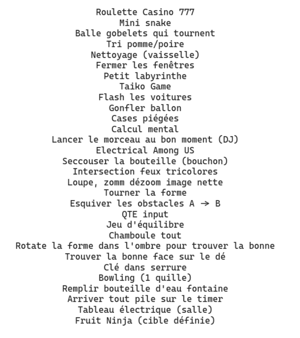

Première réflexion sur le jeu : [Réflexions](https://drive.beauget.fr/s/k7QddSGfKGkxbBa)

Après réflexion, nous proposons un **Wario Ware** like, une multitude de mini-jeux très rapide que l'on enchaine avec un certain nombre de vie (souvent quelques secondes par jeux avec une difficultée croissante). Il en va donc de soit que ces mini-jeux doivent être compréhensible au premier coup d'oeil.

<!-- truncate -->

Mise en place d'un flow chart :
[Flow Chart](https://drive.beauget.fr/s/4J2GkM3aPKNtKoE?dir=/&editing=false&openfile=true)

Répartition des tâches :
[Liste des tâches](https://tender-learning-46f.notion.site/Crazy-Teacher-27936e928c6480f79100f2da086494b1)

Identification d'une liste non exhaustive de jeu potentiels.

.

> On aimerait en faire une vingtaine. test
